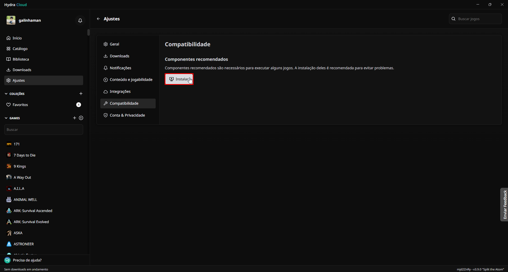
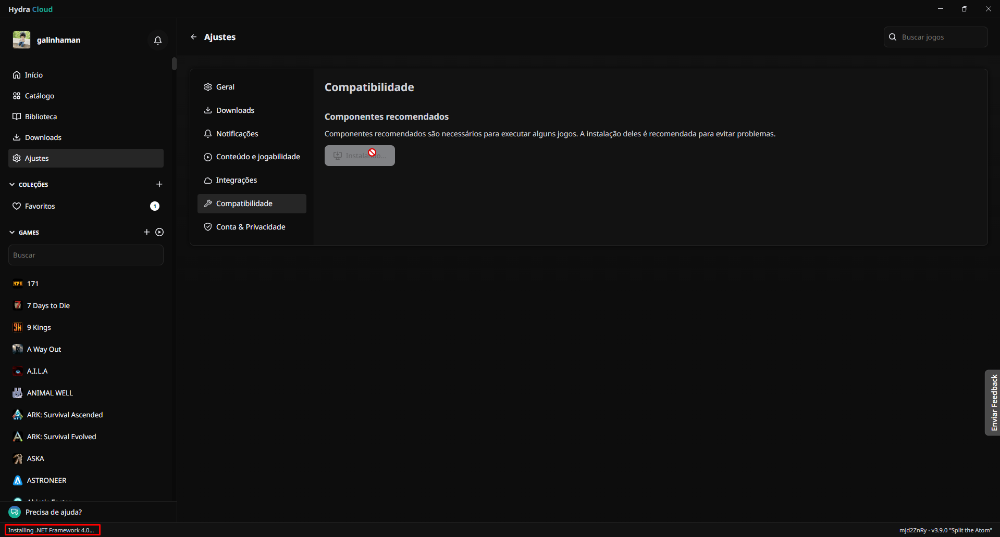
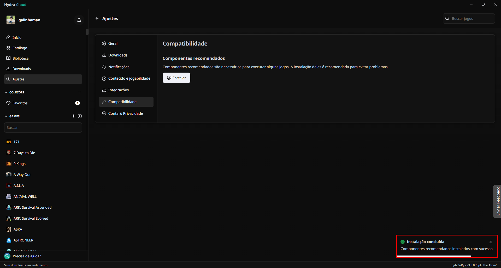

# Como instalar os componentes recomendados

Os componentes recomendados são uma série de dependências que os jogos e instaladores podem usar para funcionar. É **extremamente recomendado** instala-los para evitar problemas ao jogar os jogos do Hydra Launcher.

Aqui vai um guia para isso:

## Navegue até a aba `Ajustes`:

## Clique em `Instalar`:

::: warning Caso a aba dos componentes recomendados não apareça, significa que você está em uma versão antiga do Hydra Launcher.

Você pode encontrar a versão mais recente do Hydra [aqui](https://github.com/hydralauncher/hydra/releases/).
:::

## Espere a instalação ser concluída

## Reinicie seu computador

Após instala-los, é preciso **reiniciar o seu computador**, para todas as dependências serem carregadas no seu sistema.

___

Após a reinicialização, os componentes recomendados terão sido instalados com sucesso.