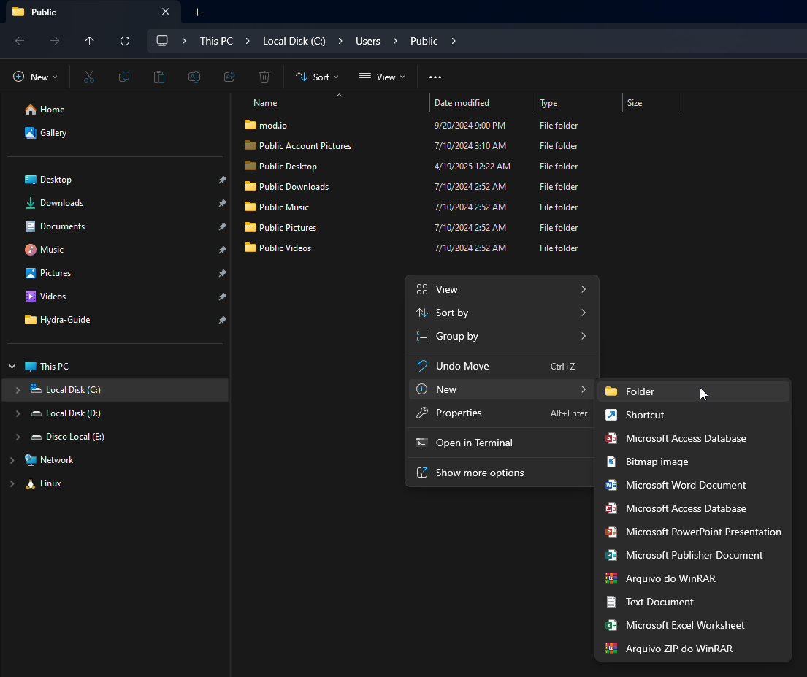
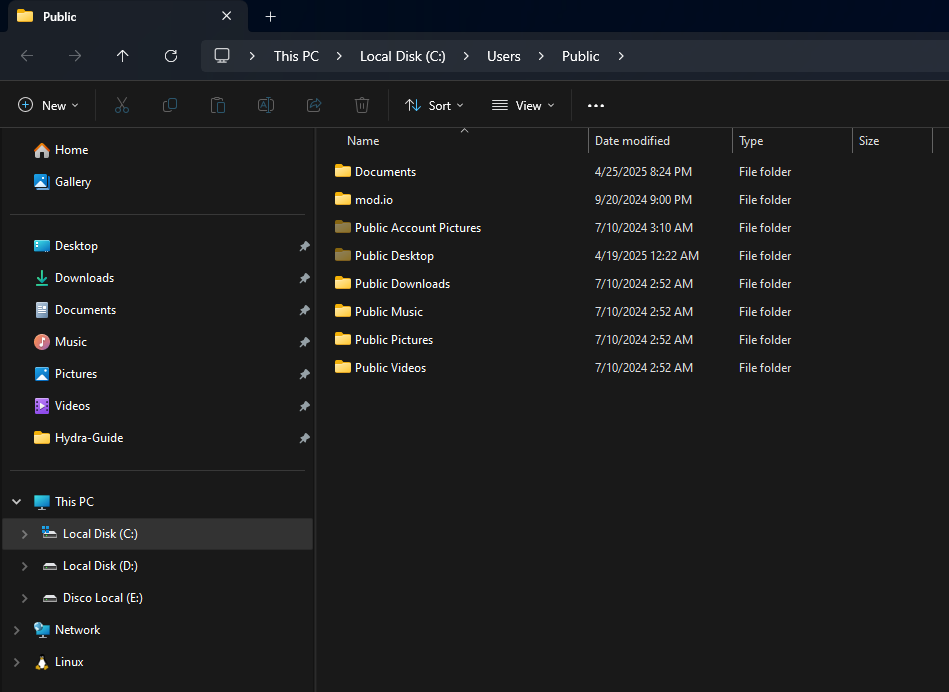

# Internal error 0x06: System error!

This error is caused when some essential folders for **cracks** to work are not present on your Windows. Therefore, you must create them manually.

To fix this, follow these steps:

## Press Windows + R, type `%public%`, and click "OK":

## Create a folder called `Documents`:

Right-click, select `New` > `Folder`, and name it `Documents`

## Open the folder you just created, and create a folder called `Steam`:

___

After that, run the game again, as administrator.