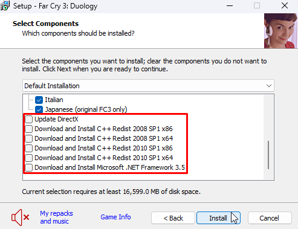

# Download failed: File not found (404) Check your connection and click 'Retry' to try downloading the files again, or click 'Cancel' to terminate setup.

This error is displayed when the installer is trying to download files for some dependencies, but those files no longer exist, so you get the 404 error message.

To fix this, start the installation setup again, but before starting the installation, **uncheck** all the options to install the common redistributables:

After that, continue with the installation process.

You can install all the recommended components [directly through Hydra](common-redistributables.md).