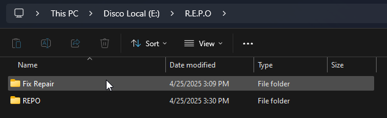
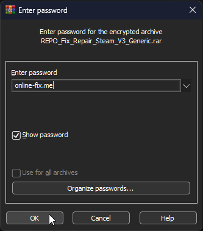
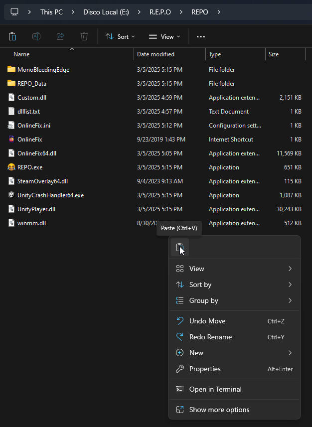

# How to apply Fix-Repair

`Fix-Repair` is a compressed file with all the **crack** files of the game, which is found in `Online-Fix` games, **for emergency purposes only**.

::: warning It is not necessary to apply it to play the game. You should only apply it when your antivirus has deleted some **crack** file and you were unable to restore it.

In this case, you must first [add an exclusion to the game folder](add-exclusion.md), and **only then** apply `Fix-Repair`. 
:::

Here's a guide on how to do this:

## Open the `Fix-Repair` folder:

## Extract the `Fix-Repair`:

::: info You need to have [`WinRAR`](https://www.win-rar.com/fileadmin/winrar-versions/winrar/winrar-x64-711.exe) installed on your computer to extract this file. :::

## Enter the password:

::: info The password `online-fix.me` is used for **all** `Online-Fix` files.
:::

## Copy all extracted files:

## Paste into the game folder:

## Replace files:

___

After replacing the files, the `Fix-Repair` has been applied.

::: info The process described in this guide is basically the same as applying any crack, in any game.
:::