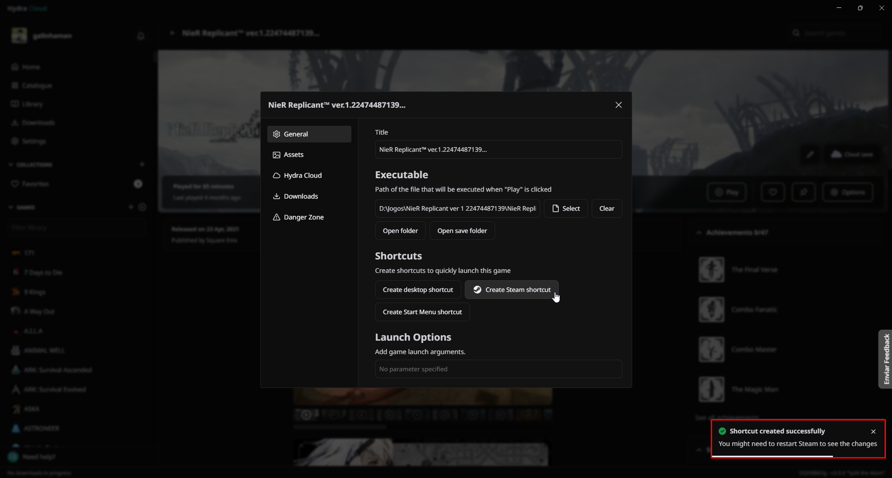
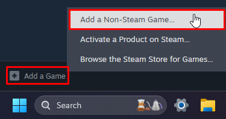
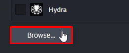
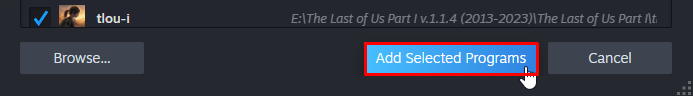
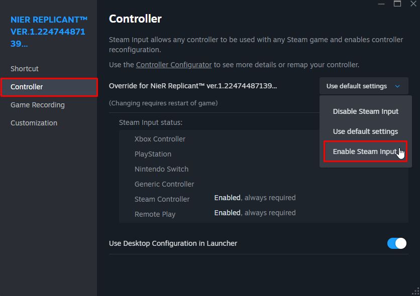

# How to add a game to Steam and enable Steam Input

Steam has a compatibility layer for generic controls called `Steam Input`, which is capable of translating the controls' commands into something that the game can often recognize, if it doesn't already recognize them natively.

::: tip If you already have the game's executable selected in Hydra, you can add it to Steam by clicking `Manage` on your page > `Create Steam shortcut`:

If you have Steam open, you need to exit it for the changes to be displayed.

This way, it will be inside Steam with all its banners, icons and images already pre-applied. This is especially useful if you use a portable device, or use Steam's `Big Picture` mode.

:::

Here's a guide on how to add a game to Steam, and enable `Steam Input`:

## Click on `Add a Game` > `Add a non-Steam Game`:

## Click on `Browse`:

## Select your game's executable:

::: tip In games that have more than one executable, such as The Last of Us Part I, select the executable responsible for keeping the game process open. 
:::

## Add the game to Steam:

Once that's done, your game will be on Steam, now you need to enable `Steam Input`.

## Right-click on it > `Properties`:

## Navigate to the `Controller` tab > Enable `Steam Input`:

___

With `Steam Input` enabled, run the game through Steam, that your controller may be recognized and will work normally.

