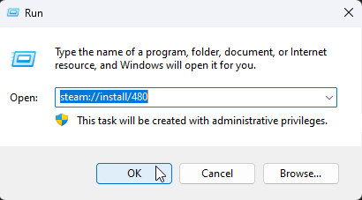

# Steamworks Fix Activation

This means that the Steamworks activation for the `Online-Fix` **crack** to work is not done, in this case, you need to do it manually.

Follow these steps:

## Press Windows + R, and type `steam://install/480`:

## Install `Spacewar`:

___

After that, run the game again.

::: tip If you want, you can uninstall Spacewar after installing it. You just need to install it so that some folders necessary for the `Online-Fix` **crack** to work are created. 
:::