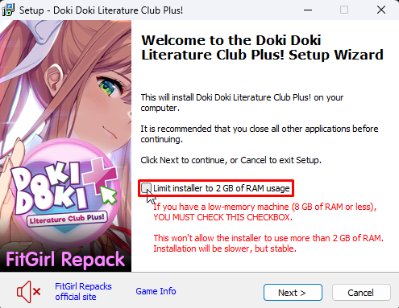

# ISDone.dll - An error occurred while unpacking: Unable to write data to disk! Unarc.dll returned an error code: -11

This error is usually caused by a lack of storage on the selected drive to install the game. In this case, free up more storage, and start installing the game again.

If you have the necessary storage, you can also [increase the virtual memory of your drive](https://support.esri.com/en-us/knowledge-base/increase-virtual-memory-beyond-the-recommended-maximum--000011346), or select another drive that you may have when installing the game.

::: tip If it is a FitGirl game, activate the RAM memory limiter at the beginning of the installation setup:

:::

If it doesn't work, install the game from another source that makes its games available in [pre-installed](download-sources.html#pre-installed) or [portable](download-sources.html#portable) format.