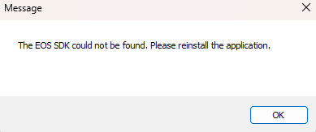

# The EOS SDK could not be found. Please reinstall the application.

Esse erro significa que algum arquivo do **crack** do jogo foi para a quarentena, você precisa [restaura-lo no Windows Defender](restore-files.md).

Após restaura-lo, execute o jogo novamente.