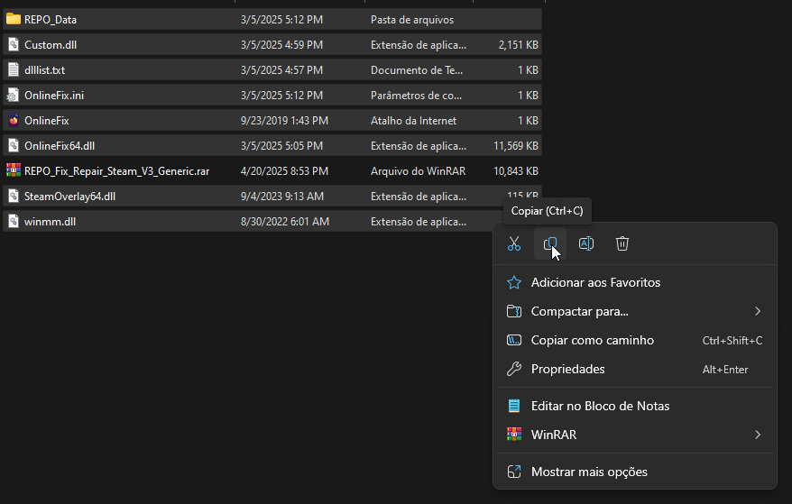

# Como aplicar o Fix-Repair

O `Fix-Repair` é um arquivo compactado com todos os arquivos do **crack** do jogo, que se encontra em jogos do `Online-Fix`, **apenas para fins emergenciais**.

::: warning Não é necessário aplica-lo para jogar o jogo. Você só deve aplica-lo quando seu antívirus deletou algum arquivo do **crack** e você não conseguiu restaura-lo.

Nesse caso, antes você deve [adicionar uma exclusão para a pasta do jogo](add-exclusion.md), e **somente depois** aplicar o `Fix-Repair`.
:::

Aqui vai um guia de como fazer isso:

## Abra a pasta `Fix-Repair`:

## Extraia o `Fix-Repair`:

::: info É preciso ter o [`WinRAR`](https://www.win-rar.com/fileadmin/winrar-versions/winrar/winrar-x64-711br.exe) instalado no seu computador para extrair esse arquivo.
:::

## Digite a senha:

::: info A senha `online-fix.me` é usada para **todos** os arquivos do `Online-Fix`.
:::

## Copie todos os arquivos extraídos:

## Cole dentro da pasta do jogo:

## Substitua os arquivos:

___

Após substituir os arquivos, o `Fix-Repair` foi aplicado.

::: info O processo descrito nesse guia é basicamente o mesmo processo de aplicar qualquer crack, em qualquer jogo.
:::