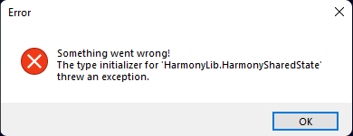

# Something went wrong! The type initializer for 'HarmonyLib.HarmonyShadedState' threw an exception.

Esse erro significa que algum acento ou caracter especial está presente no caminho do jogo. Você precisa [mover a pasta do jogo para a raiz do seu disco](root-drive.md).

Após isso, execute o jogo novamente.