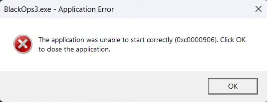

# The application was unable to start correctly (0xc0000906). Click OK to close the application.

This error means that some file of the **crack** of the game was quarantined, you need to [restore it in Windows Defender](restore-files.md).

After restoring it, run the game again.