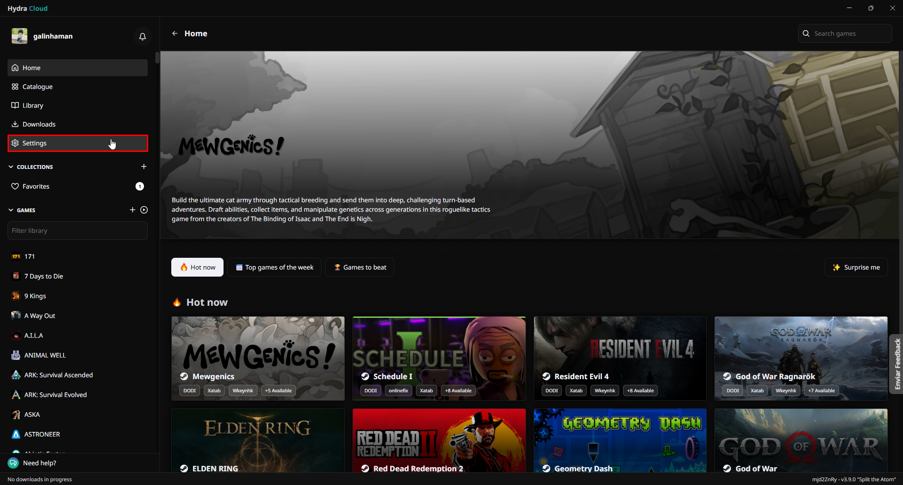
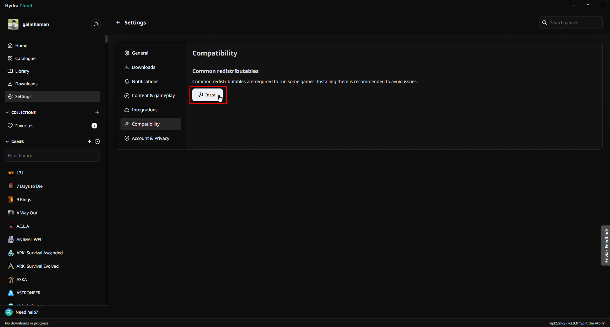

# How to install the common redistributables

Common redistributables are a series of dependencies that games and installers can use to function. It is **highly recommended** to install them to avoid problems when playing Hydra Launcher games.

Here is a guide to do so:

## Navigate to the `Settings` tab:

## Click on `Install`:

::: warning If the Common redistributables tab does not appear, it means that you are on an old version of Hydra Launcher.

You can find the latest version of Hydra [here](https://github.com/hydralauncher/hydra/releases/). 
:::

## Wait for the installation to complete

## Restart your computer

After installing them, you need to **restart your computer**, so that all dependencies are loaded on your system.

___

After the restart, the common redistributables will have been successfully installed.