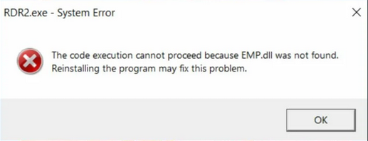

# The code execution cannot proceed because EMP.dll was not found. Reinstalling the program may fix this problem.

The file `EMP.dll` has been quarantined, you need to [restore it in Windows Defender](restore-files.md).

After restoring `EMP.dll`, run the game again.