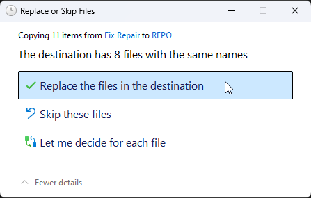

# Как использовать папку Fix-Repair

`Fix-Repair` это папка, в которой находится **взломанные** файлы игры, которую можно найти в играх от `Online-Fix`, **Только для экстренных случаев**.

::: warning Не обязательно использовать ее для того что бы играть онлайн. Эта папка создана на случай если ваш антивирус удалит **взломанный** файл и вы не сможете его восстановить.

В таком случае вы должны сначала [добавить папку в исключения антивируса](add-exclusion.md), **и только тогда** использовать файлы с папки `Fix-Repair`. 
:::

Инструкция как это сделать:

## Откройте папку `Fix-Repair`:

## Распакуйте папку `Fix-Repair`:

::: info вы должны иметь [`WinRAR`](https://www.win-rar.com/fileadmin/winrar-versions/winrar/winrar-x64-711.exe) установленным на вашем ПК для распаковки. 
:::

## Введите пароль:

::: info Пароль `online-fix.me` используется во **всех** архивах `Online-Fix`.
:::

## Скопируйте все распакованые файлы:

## Вставьте их в папку с игрой:

## Замените файлы:

___

После замены файлов, можете удалять папку `Fix-Repair`.

::: info Процесс, описанный в этом руководстве, по сути такой же, как применение любого кряка в любой игре..
:::
