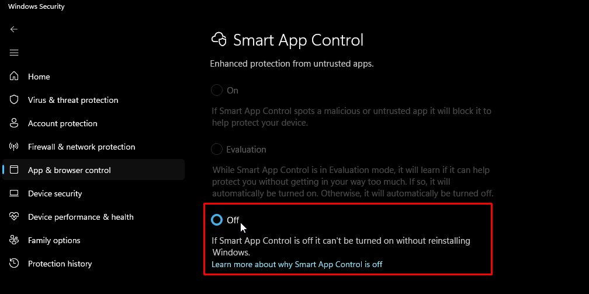

# How to disable `Smart App Controll`

`Smart App Controll` is an option of `Windows Defender` that blocks malicious files from executing on your system. However, it tends to flag crack files as mallicious. Therefore, sometimes you need to disable it to run a pirated game.

::: info Crack files are modified files to bypass the game's digital protection (DRM). Because of this, antiviruses can assign a generic virus identification to these files, even though they are not. This is called a `false positive`. 
:::

Here's a guide on how to disable it:

## Open the Start menu and search for `App & browser control`:

## Click on `Smart App Control settings`:

## Click on `Off`:

::: info After turning this option off, you cannot turn it back on until you reinstall Windows. However, since this option does not provide any substancial advantage while being turned on, you can ignore this warning.
:::
