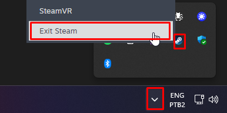
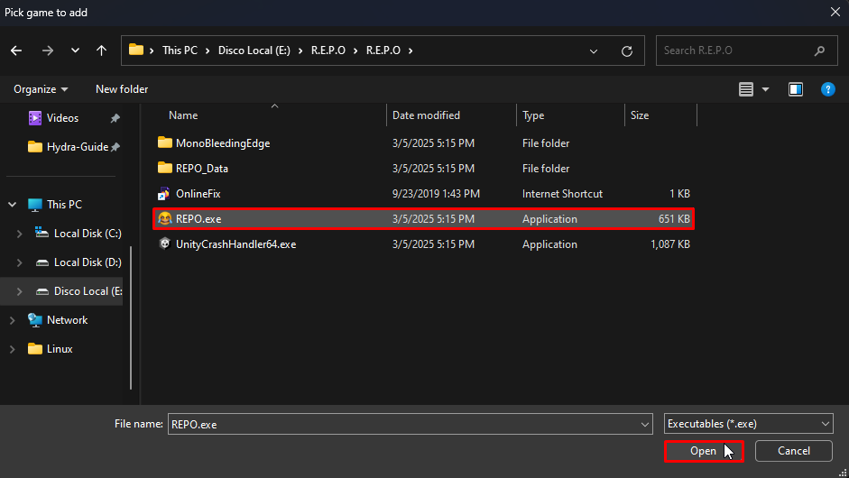
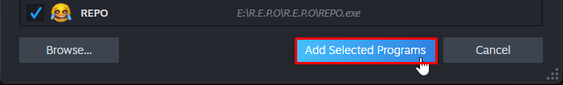

# Steam is not launched.

## Open Steam

This error occurs in `Online-Fix` games, where Steam needs to be open for multiplayer to work.

You need to open Steam, and log in to an account if you are not already logged in.

With Steam open and logged in, open the game again.

If the error persists, follow these steps:

## Close Steam completely:

## Open Steam as an administrator:

## Add your game to Steam:

## Open your game through Steam

