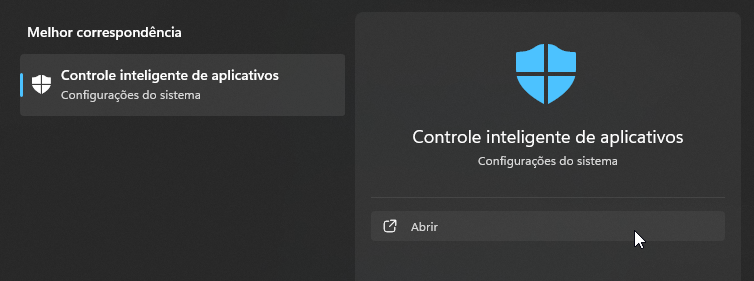
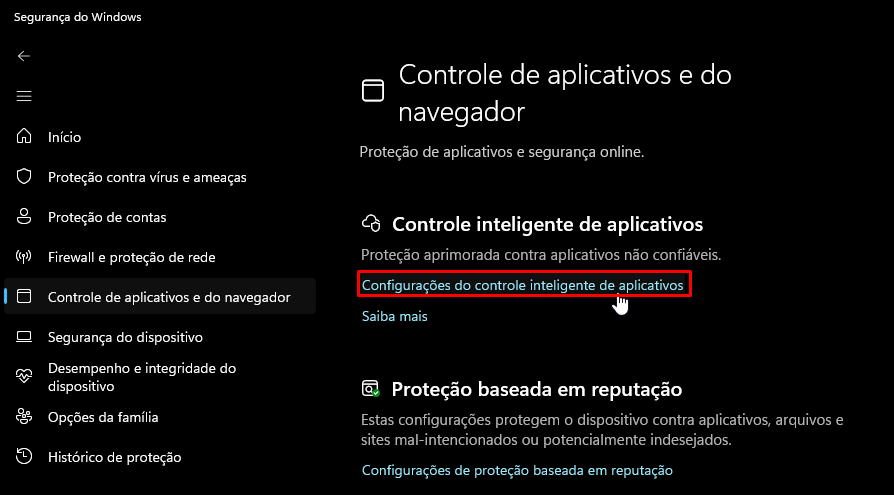
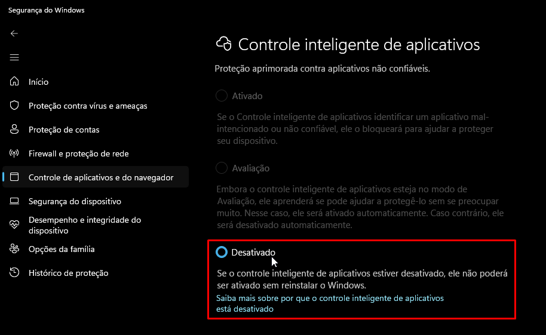

# Como desativar o `Controle Inteligente de Aplicativos`

O `Controle Inteligente de Aplicativos` é uma opção do `Windows Defender` que bloqueia a execução de arquivos maliciosos no seu sistema. No entanto, ele tende a sinalizar arquivos crackeados como maliciosos. Por conta disso, as vezes é preciso desativá-lo para executar um jogo pirata.

::: info Arquivos crackeados são arquivos modificados para burlar a proteção digital (DRM) do jogo. Por causa disso, os antivírus podem atribuir uma identificação genérica de vírus a esses arquivos, mesmo que não sejam. Isso é chamado de `falso positivo`.
:::

Aqui está um guia sobre como desativá-lo:

## Abra o menu Iniciar e pesquise por `Controle inteligente de aplicativos`:

## Clique em `Configurações do controle inteligente de aplicativos`:

## Clique em `Desativado`:

::: info Depois de desativar esta opção, você não poderá ativá-la novamente até reinstalar o Windows. No entanto, como essa opção não oferece nenhuma vantagem substancial enquanto estiver ativada, você pode ignorar este aviso.
:::