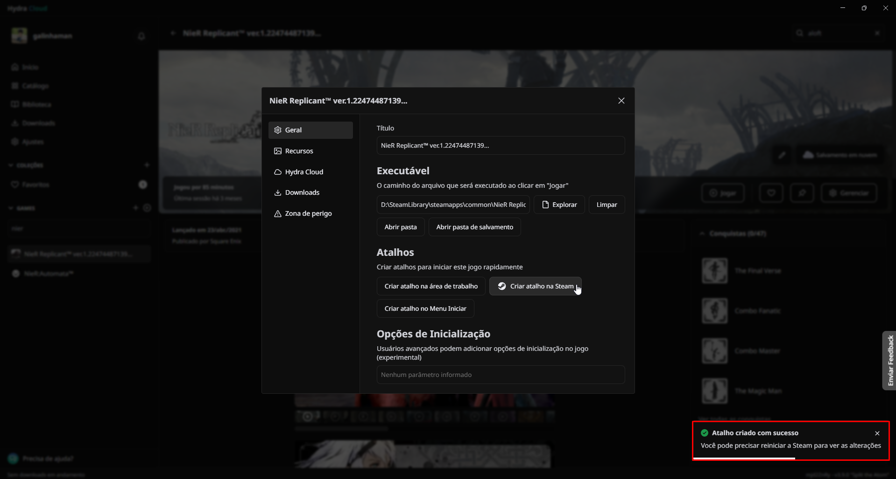
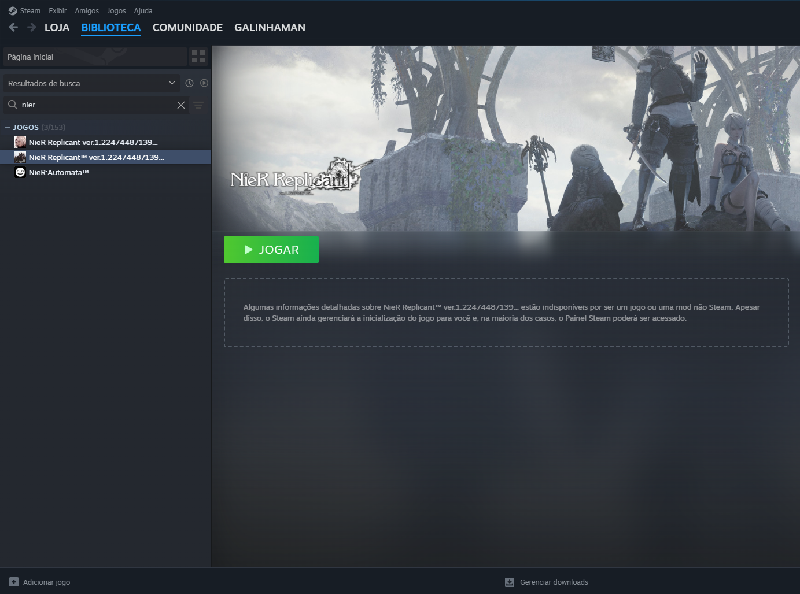
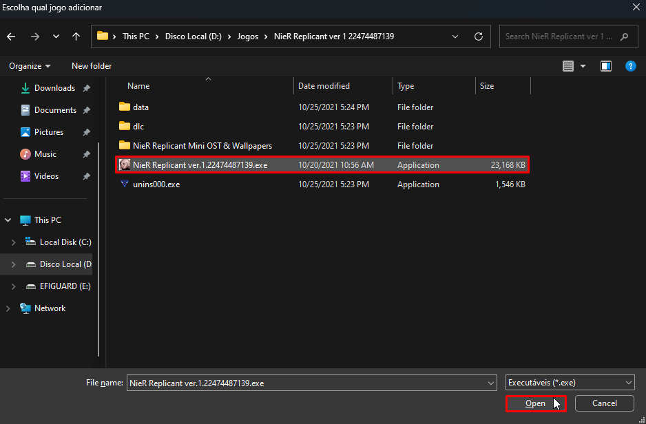
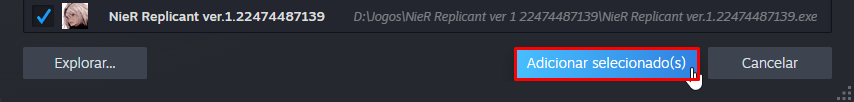
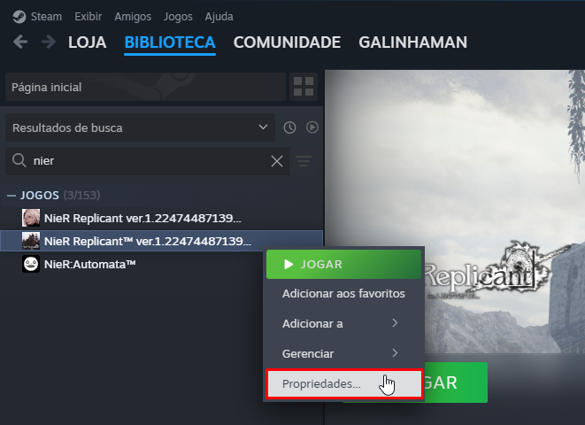
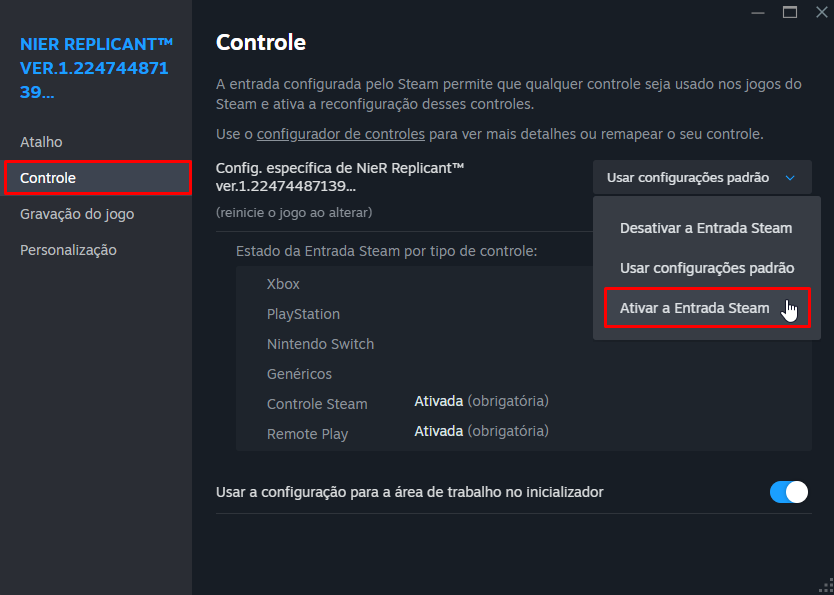
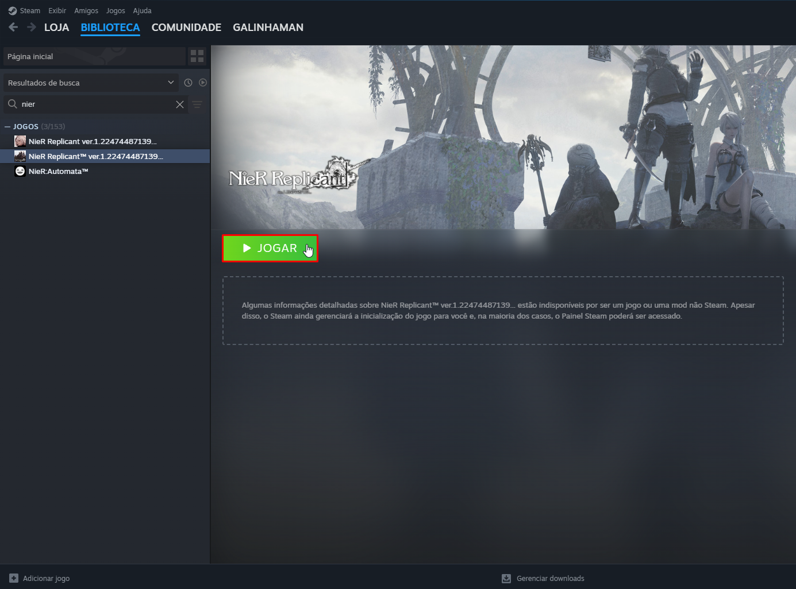

# Como adicionar um jogo na Steam e habilitar o Steam Input

A Steam possui uma camada de compatibilidade para controles genéricos chamada `Steam Input`, que é capaz de traduzir os comandos dos controles para algo que muitas vezes o jogo possa reconhecer, caso já não reconheça nativamente.

::: tip Caso você já tenha o executável do jogo selecionado no Hydra, você pode adiciona-lo na Steam clicando em `Gerenciar` na sua página > `Criar atalho na Steam`:

Caso você esteja com sua Steam aberta, é preciso encerra-la para que as mudanças sejam exibidas.

Dessa forma, ele estará dentro da Steam com todos seus banners, ícones e imagens já pré aplicados. Isso é especialmente útil caso utilize algum portátil, ou use o modo `Big Picture` da Steam.

:::

Aqui vai um guia de como adicionar um jogo na Steam, e habilitar o `Steam Input`:

## Clique em `Adicionar jogo` > `Adicionar um jogo não steam`:

## Clique em `Explorar`:

## Selecione o executável do seu jogo:

::: tip Em jogos que possuem mais de um executável, como o The Last of Us Part I, selecione o executável responsável por manter o processo do jogo aberto.
:::

## Adicione o jogo na Steam:

Feito isso, seu jogo já estará na Steam, agora é preciso habilitar o `Steam Input`.

## Clique com o botão direito nele > `Propriedades`:

## Navegue até a aba `Controle` > Ative o `Steam Input`:

___

Com o `Steam Input` habilitado, abra o jogo pela Steam, que seu controle possivelmente será reconhecido e irá funcionar normalmente.

