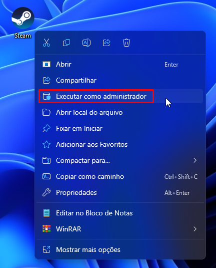
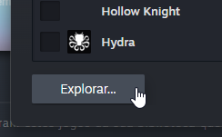
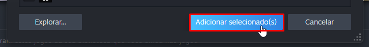
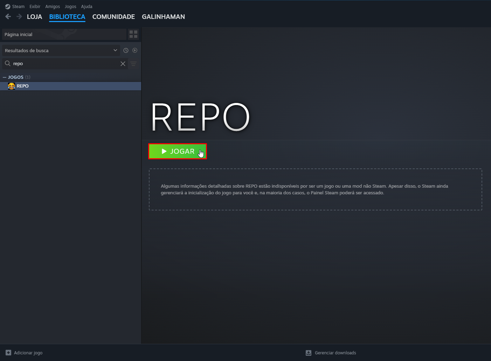

# Steam is not launched.

## Abra a Steam

Esse erro acontece em jogos do `Online-Fix`, onde precisam da Steam aberta para que o multiplayer funcione. 

Você precisa abrir a Steam, e logar em uma conta caso não esteja logado.

Com a Steam aberta e logada, abra o jogo novamente.

Caso o erro persista, siga os passos a seguir:

## Feche a Steam completamente:

## Abra a Steam como administrador:

## Adicione seu jogo na Steam:

## Abra seu jogo pela Steam

