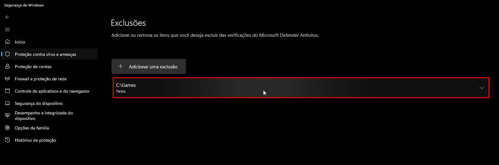

# ISDone.dll - An error occurred while unpacking! Unarc.dll returned an error code: -1/-12

Estes erros podem ser causados por falta de uma versão do Visual C++ no seu computador. Portanto, instale o [componentes recomendados](common-redistributables.md).

Além disso, é recomendado criar uma pasta para instalar seus jogos, [adicionar uma exclusão](add-exclusion.md) para ela, e seleciona-la no setup:

Após isso, comece a instalação novamente.

::: tip Caso seja um jogo da FitGirl, também ative o limitador de memória RAM no começo do setup de instalação:

:::

Se o erro persistir, instale o jogo de alguma outra fonte que disponibilize seus jogos de maneira [pré-instalada](download-sources.html#pre-instalado) ou [portable](download-sources.html#portable).