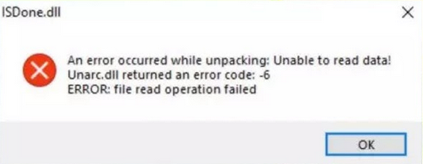

# ISDone.dll - An error occurred while unpacking! Unarc.dll returned an error code: -6

Este erro pode ser causado por falta de uma versão do Visual C++ no seu computador. Portanto, instale o [componentes recomendados](common-redistributables.md).

Além disso, [mova a pasta do setup para a raiz do seu disco](root-drive.md), e selecione para instalar o jogo na raiz do seu disco também:

Após isso, comece a instalação novamente.

::: tip Caso seja um jogo da FitGirl, também ative o limitador de memória RAM no começo do setup de instalação:

:::

Se o erro persistir, instale o jogo de alguma outra fonte que disponibilize seus jogos de maneira [pré-instalada](download-sources.html#pre-instalado) ou [portable](download-sources.html#portable).