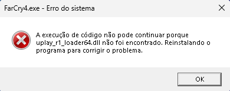

# Erro do sistema - A execução de código não pode continuar porque uplay_r1_loader64.dll não foi encontrado. Reinstalando o programa para corrigir o problema.

O arquivo `uplay_r1_loader64.dll` ficou em quarentena, você precisa [restaura-lo no Windows Defender](restore-files.md).

Após restaurar o `uplay_r1_loader64.dll`, execute o jogo novamente.